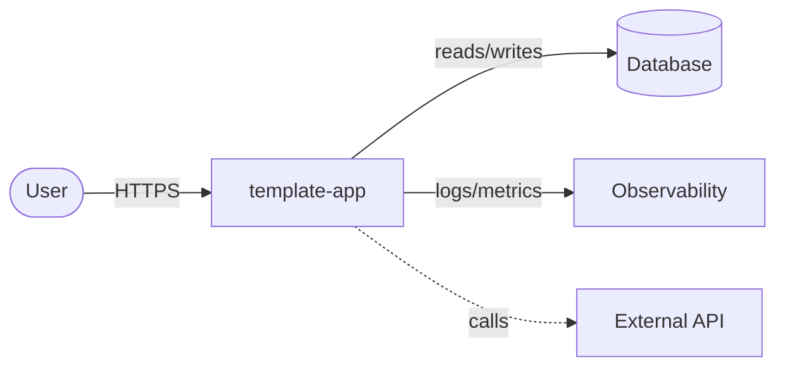
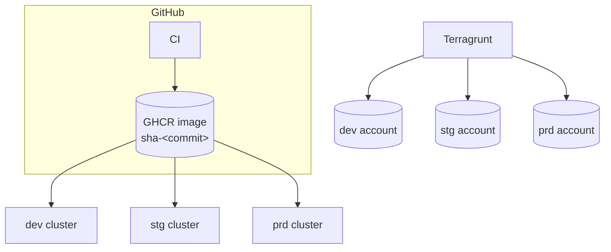

# Architecture overview

> Living document. Describe the system as it **is**, not as it was planned.
> Replace the placeholders (`<...>`) with your system's details.

## 1. Context

<What problem does the system solve, for whom, and what are its boundaries?>

## 2. Quality goals

| Priority | Attribute | Target / scenario |
|----------|-----------|-------------------|
| 1 | Availability | 99.9% monthly in `prd` |
| 2 | Performance | p95 < 300 ms at nominal load (enforced by k6 thresholds) |
| 3 | Security | No long-lived cloud credentials; least-privilege IAM |

## 3. Containers & components

| Component | Tech | Responsibility | Source |
|-----------|------|----------------|--------|
| API | Python (sample) | Serves HTTP API | `app/` |
| Infra baseline | Terraform | Bucket, logs | `infra/terraform/modules/app-baseline` |
| Runtime | Kubernetes + Helm | Runs the containers | `infra/deploy/helm/app` |

## 4. Deployment view

Each environment lives in its own cloud account; state is isolated per environment.

## 5. Delivery pipeline

See [delivery-pipeline.md](delivery-pipeline.md).

## 6. Cross-cutting concerns

- **Configuration:** 12-factor, environment variables; per-env Helm values.
- **Secrets:** <secret manager of choice>; never in git or images.
- **Observability:** structured logs to stdout; health endpoints `/healthz`, `/readyz`.
- **Security:** non-root, read-only root FS, dropped capabilities, image scanning, IaC scanning.

## 7. Risks & technical debt

| Risk | Impact | Mitigation |
|------|--------|------------|
| <...> | <...> | <...> |

## 8. Decisions

See the [ADR log](../adr/).
