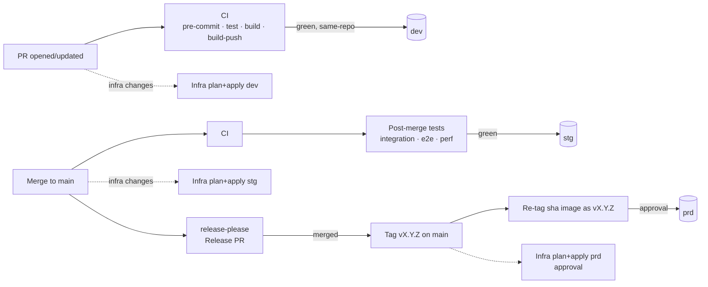

# Delivery pipeline

Principle: **build once, promote the same immutable artifact**. Every image is
tagged `sha-<commit>`; environments only differ by configuration.

## Workflows

| Workflow | File | Triggers | Does |
|----------|------|----------|------|
| CI | `ci.yml` | PR opened/updated, push to `main` | pre-commit, unit tests, app build, multi-arch image build + push (GHCR, SBOM, provenance), Trivy scan. `ci-ok` aggregates for branch protection. |
| Post-merge tests | `post-merge-tests.yml` | CI green on `main` | Runs the CI-built image via compose; integration, e2e and k6 perf suites in a matrix. |
| Infrastructure | `infra.yml` + `_terragrunt.yml` | PR → dev, `main` → stg, tag → prd, manual | fmt, tflint, validate, Trivy IaC scan; then plan + apply per env. |
| Release | `release-please.yml` | push to `main`, manual | Opens/updates the Release PR (SemVer bump + `CHANGELOG.md` from Conventional Commits); when it is merged, creates tag `vX.Y.Z` + GitHub Release, which triggers prd. |
| CD | `cd.yml` + `_deploy.yml` | CI (PR) → dev, post-merge tests (`main`) → stg, tag → prd, manual | Resolves a matrix of envs, deploys sequentially with Helm, smoke-tests, rolls back on failure. |

## Environment routing

| Event | Infra | App deploy |
|-------|-------|------------|
| Pull request (same repo) | `dev` | `dev` (image `sha-<head>`) |
| Pull request (fork) | static checks only | none |
| Merge to `main` | `stg` | `stg` after post-merge tests pass |
| Tag `vX.Y.Z` from the merged Release PR (commit must be on `main`) | `prd` | `prd` (image re-tagged `vX.Y.Z`, no rebuild) |
| `workflow_dispatch` | chosen env, plan or apply | comma-separated env list, promoted in order |

> `dev` is shared: the most recent PR deployment wins. Use preview namespaces
> (e.g. `NAMESPACE=app-pr-<n>`) if you need isolation per PR.

## Required GitHub configuration

**Environments** (`Settings → Environments`): `dev`, `stg`, `prd`.

| Environment | Protection | Variables |
|-------------|-----------|-----------|
| `dev` | none | `DEPLOY_ROLE_ARN`, `TF_APPLY_ROLE_ARN`, `CLUSTER_NAME`, `BASE_URL` |
| `stg` | deployment branches: `main` | same |
| `prd` | required reviewers; deployment tags: `v*.*.*` | same |

**Repository variables:** `AWS_REGION`, `TF_PLAN_ROLE_ARNS` (JSON map of
read-only plan roles, e.g. `{"dev":"arn:aws:iam::111111111111:role/gha-plan"}`).

**Release app:** a GitHub App (permissions: Contents, Pull requests, Issues -
read/write) installed on the repo; repository variable `RELEASE_APP_ID` and secret
`RELEASE_APP_PRIVATE_KEY`. Its token is required because tags and PRs created with
`GITHUB_TOKEN` do not trigger other workflows (CI on the Release PR, prd on the tag).

**Branch protection on `main`:** require PR + review, require status checks
`ci-ok` and `validate` (infra), require linear history, restrict tag creation
for `v*` to maintainers and the release app.

**Cloud trust (AWS example):** one IAM OIDC provider per account
(`token.actions.githubusercontent.com`). Scope role trust policies by the `sub`
claim, e.g. `repo:OWNER/REPO:environment:prd` for prd apply/deploy roles and
`repo:OWNER/REPO:pull_request` for dev.
