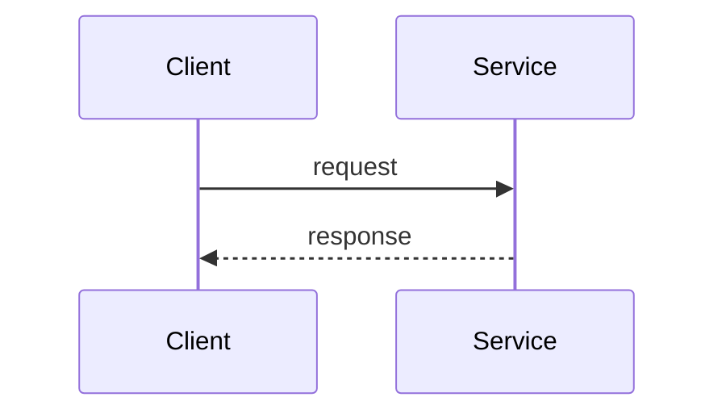

# RFC-NNNN: <Title>

- **Status:** Draft | In review | Accepted | Rejected | Withdrawn | Implemented
- **Author(s):** @someone
- **Reviewers:** @team-a, @team-b
- **Created:** YYYY-MM-DD · **Review deadline:** YYYY-MM-DD
- **Tracking issue:** #

## Summary

One paragraph: what are we proposing?

## Motivation

Why now? What problem, for whom? Include data (incidents, metrics, costs).

## Goals / Non-goals

- **Goals:** ...
- **Non-goals:** ...

## Proposal

The design in enough detail to review: diagrams, APIs, data model, flows.

## Alternatives considered

What else, and why not?

## Impact

- **Security & privacy:**
- **Reliability & operability:** (SLOs, alerts, runbooks)
- **Performance & cost:**
- **Migration & rollback:**
- **Teams / dependencies affected:**

## Rollout plan

Phases, feature flags, success metrics, exit criteria.

## Open questions

- ...

## Decision

<Filled in when the RFC is closed: outcome, date, and links to resulting ADRs.>
